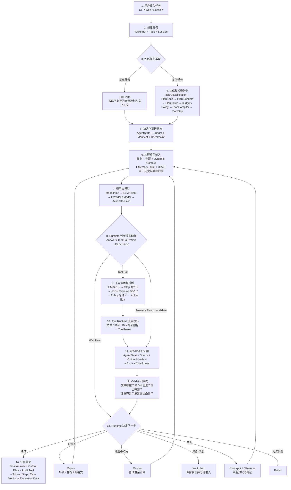
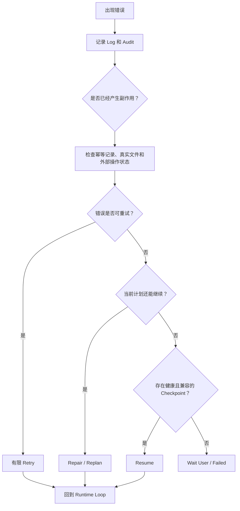
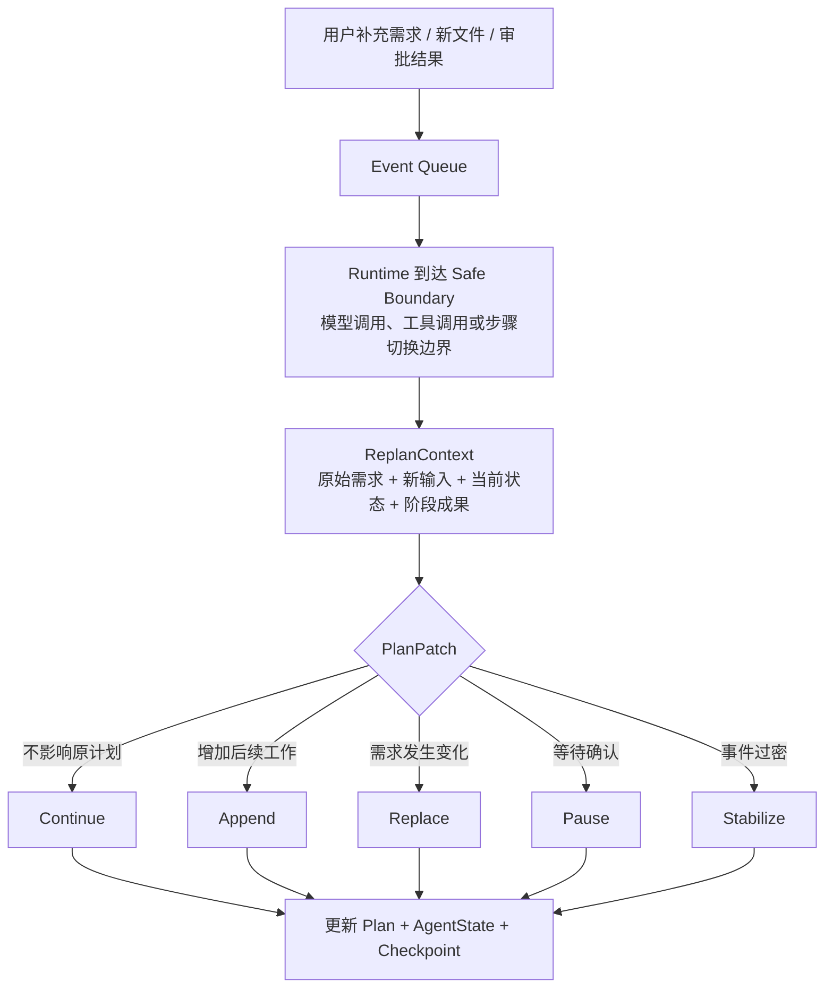

# Gangent

Gangent 是一个个人 Agent Runtime / Agent Harness 工程 prototype，用于验证 Agent 从“能回答”走向“能稳定执行任务”所需要的执行层基础设施。

它关注的不是聊天界面本身，而是 planner、tool boundary、dynamic context、checkpoint / resume、event queue、policy、audit、budget control、model routing 和 memory / retrieval 这些能力如何被拆清楚、跑起来、记录下来、测试起来并持续改进。

快速入口：[整体架构与流程图](docs/gangent-architecture-flow.html) · [记忆图谱查看器](memory_graph_viewer.html) · [完整说明书](docs/manual.md) · [API Contracts](docs/api-contracts.md)

## 项目定位

- 个人 Agent：在本地工作区内执行文件读写、代码修改、命令运行、Git 操作、任务交接和工作流验证。
- 技术验证平台：把 Agent Harness Engineering 的想法沉淀为可运行、可测试、可审计的模块、状态和运行日志。
- 持续演进原型：prototype 不是一次性 demo，而是用于长期验证执行稳定性、恢复能力、上下文管理和预算控制的工程底座。

## 已实现能力

- CLI 交互入口，支持持续会话、任务恢复和人工确认。
- DeepSeek 与 OpenAI-compatible API 接入。
- 结构化 tool calling，使用 JSON Schema 描述工具参数；注册时检查 Schema 本身，执行前统一校验参数，失败后返回可重试的结构化问题而不产生工具副作用。
- Policy decision，支持 `allow` / `block` / `escalate`。
- 文件工具：读取、分块读取、写入、编辑、patch、多文件读取、路径元信息检查和受限 grep。
- 命令工具：结构化 argv 执行、超时控制、输出截断和风险分级。
- Git 工具：status、diff、log、show、add、commit。
- Checkpoint / resume，支持中断后继续执行。
- Idempotency，降低恢复任务时重复写入、重复提交等副作用风险。
- Context segment，记录来源、范围、优先级、置信度和敏感度。
- Context pollution diagnostics，在模型调用前检查来源分布、低置信信息、敏感片段和预算压力。
- Cooperative interrupt event queue，在安全边界处接入外部输入。
- Event-aware replanning，在模型调用前把原始用户输入、运行状态、新事件和阶段性成果打包成 ReplanContext，并生成可审计的 PlanPatch。
- Session persistence 与 audit JSONL。
- Local retrieval 与 retrieval log。
- Planner contract：PlanSpec、PlanLinter、PlanCompiler。
- Planner budget control，根据剩余步骤、任务压力和历史成功参数约束计划粒度。
- Runtime plan guard，按阶段限制可调用工具，降低计划漂移。
- Successful-task budget history，用于后续 planner 优化。
- DeepSeek prefix cache diagnostics，记录 cache hit / miss token 和 stable prefix hash。
- Flash-first / Pro-escalation model router。
- Source Manifest / Output Manifest / Validator Layer，用源文件清单、输出文件清单和确定性验证减少“口头完成但文件未生成”的失败。
- Lightweight Web Shell，提供类似 ChatGPT / Codex 的轻量对话壳子：主区显示对话，底部输入，顶部临时显示“正在思考 / 正在读写文件 / 正在保存 checkpoint”，右上角可展开 event 与 runtime 状态；任务运行中继续输入会写入 event queue。
- Hooks、runtime skills 和 MCP adapter。
- Web fetch tool with policy gating。

当前测试状态：`315` 个 unittest 用例通过。

## Gangent 整体工作流程

Gangent 把一次 Agent 任务拆成任务建立、计划、模型决策、权限控制、真实执行、状态更新、结果验证和失败恢复。模型负责理解任务并提出候选动作，Runtime 负责协调执行，Harness 负责约束、验证、追踪和恢复。



### 14 步主链路

| 步骤 | 核心对象 | 作用 |
|---:|---|---|
| 1 | CLI / Web / Session | 接收用户任务。 |
| 2 | TaskInput / Task / Session | 标准化任务目标、工作区和会话。 |
| 3 | Task Classification | 简单任务走 Fast Path，复杂任务进入 Planner。 |
| 4 | PlanSpec / PlanLinter / PlanCompiler | 生成、检查并编译 Runtime 可执行的 PlanStep。 |
| 5 | AgentState / Budget / Manifest / Checkpoint | 初始化状态、资源约束、输入输出契约和恢复点。 |
| 6 | Context / Memory / Skill / Tools | 只组装当前模型调用真正需要的信息和能力。 |
| 7 | ModelInput / LLM Client / Provider | 调用模型并解析为结构化 ActionDecision。 |
| 8 | Runtime | 区分 Answer、Tool Call、Wait User 和 Finish 候选。 |
| 9 | Tool Registry / Plan Guard / Schema Validator / Policy / Approval | 在真实执行前检查工具、步骤范围、参数结构、权限和风险。 |
| 10 | Tool Runtime / ToolResult | 执行文件、命令、Git 或外部服务调用。 |
| 11 | AgentState / Manifest / Audit / Checkpoint | 写回结果、来源、产物、证据和恢复状态。 |
| 12 | Validator / Finish Guard | 检查真实文件、JSON、完整性、证据和退出条件。 |
| 13 | Repair / Replan / Wait / Resume / Failed | 根据验证和状态决定继续方式。 |
| 14 | Final Output / Metrics / Evaluation | 输出答案、文件、审计轨迹和任务统计。 |

Runtime 的主循环可以压缩为：

```text
读取状态
→ 构建上下文
→ 调用模型
→ 解析动作
→ 检查权限
→ 执行工具
→ 更新状态
→ 验证结果
→ 继续、修复、重规划或完成
```

Fast Path 只省略不必要的重型规划、宽上下文和完整工具面，不绕过 Policy、真实执行检查和 Validator。

### 异常恢复流程



恢复不是简单增加 Retry 或重新执行全部任务。Runtime 会先检查是否已经产生文件、网络、Git 等副作用，再根据错误类型、重复模式、剩余预算和 Checkpoint 健康度决定有限重试、窄范围修复、重规划、恢复或停止。

### 运行中接入新需求



Gangent 不强制杀死正在执行的 LLM 或 Tool Call，而是在安全处理点消费事件，保留已经完成的阶段成果，并避免状态记录与真实副作用不一致。

### 核心执行边界

```text
Model proposes action
  → Runtime parses ActionDecision
  → Plan Guard checks current-step capability
  → Policy checks permission and risk
  → Tool Registry resolves the tool
  → Tool Runtime executes the real operation
  → AgentState / Manifest / Audit / Checkpoint record the result
  → Validator decides whether the task may finish
```

Gangent 的核心原则是：模型负责推理和提出动作，Runtime 负责协调真实执行，Harness 负责权限、状态、验证、恢复、审计和成本边界。

## 关键模块

| 方向 | 主要文件 | 作用 |
|---|---|---|
| CLI / Session | `gangent/cli.py`, `gangent/session_store.py` | 用户入口、会话恢复、人工确认、handoff export |
| Runtime | `gangent/runtime.py`, `gangent/adaptive_runtime.py` | 主循环、预算选择、继续执行、失败保护 |
| Planner | `gangent/planner.py`, `gangent/planner_contract.py`, `gangent/planner_budget.py` | 任务拆解、计划契约、预算约束和计划编译 |
| Context | `gangent/context_manager.py`, `gangent/context_maintenance.py` | 上下文组装、污染诊断、稳定前缀维护 |
| Event | `gangent/events.py` | 外部输入队列与 cooperative interrupt |
| Model | `gangent/llm_client.py`, `gangent/providers.py`, `gangent/model_input.py` | Provider 接入、模型输入构建、模型路由 |
| Decision | `gangent/decision.py` | 将模型输出解析为结构化动作 |
| Tool | `gangent/tool_schema.py`, `gangent/schema_validator.py`, `gangent/tool_registry.py`, `gangent/tool_runtime.py` | 工具描述、统一参数校验、注册和实际执行 |
| Policy | `gangent/policy.py`, `gangent/permissions.py`, `gangent/command_policy.py` | 路径边界、命令风险、动作放行 / 阻断 / 升级 |
| State | `gangent/state.py`, `gangent/checkpoint.py`, `gangent/runtime_checkpoint.py` | 任务状态、checkpoint、resume data |
| Audit | `gangent/audit.py`, `gangent/budget_stats.py` | 执行日志、预算历史、可追踪记录 |
| Retrieval | `gangent/rag.py`, `gangent/embeddings.py` | Local retrieval、RAG 扩展入口 |
| Extension | `gangent/hooks.py`, `gangent/skills.py`, `gangent/mcp_adapter.py` | Hooks、skills、MCP adapter |

Gangent 当前保留 local retrieval 与 embedding 扩展入口，用于后续验证 dynamic context loading、GraphRAG 和 long-term memory。

## 技术重点

### Planner 约束

Gangent 不让 planner 完全自由生成任意步骤，而是引入 PlanSpec、PlanLinter 和 PlanCompiler：

- PlanSpec 定义任务阶段、允许工具、预期输出和预算信息。
- PlanLinter 检查计划是否过粗、过细、越权或预算不匹配。
- PlanCompiler 将计划编译成 runtime 可执行结构。
- Planner budget control 将剩余步骤、任务压力和历史成功参数写入模型上下文，减少无约束规划带来的 token 浪费。

### Dynamic Context

Gangent 把输入信息拆成带元数据的 ContextSegment，而不是把全部历史直接塞进 prompt：

- source
- scope
- priority
- confidence
- sensitivity

在模型调用前，runtime 会生成 ContextPollutionReport，用于检查上下文是否包含过多无关信息、低置信信息、敏感片段或超预算内容。

### Checkpoint / Resume

长任务执行中，Gangent 会写入 checkpoint、audit 和 session 状态：

- checkpoint 负责恢复任务进度。
- audit 负责追踪每一步行为。
- session 负责保留当前会话上下文。
- idempotency 记录已经执行过的关键动作，降低恢复时重复写文件、重复提交等风险。

### Tool Boundary

模型不能直接操作系统。所有动作必须经过：

```text
ActionDecision -> Policy Check -> Tool Registry -> Tool Runtime
```

这让文件、命令、Git、网页访问等动作都可以被统一审计、限制和升级确认。

### Budget / Model Routing

CLI 内支持运行时切换预算档位：

```text
/budget show
/budget auto
/budget light
/budget medium
/budget heavy
/budget ultra
```

如果启动时只写 `--provider deepseek` 且不强制 `--model`，默认走 `deepseek-v4-flash`。当任务被判定为 heavy 高风险、ultra 或 thinking 模式时，模型路由可以升级到 `deepseek-v4-pro`；如果显式指定 `--model deepseek-v4-flash`，则尊重用户指定。

当前预算自学习采用保守启发式策略：runtime 会记录成功任务的 step、tool call、duration、token usage 和 cache hit / miss，并用同类成功样本的 p80 附近结果给后续任务提供预算建议。当前策略只谨慎上调，不自动下调，并受各档位硬上限约束，避免为了省 token 牺牲稳定性。

Gangent 记录成功任务的预算参数，并将 DeepSeek prefix cache 命中情况写入历史数据：

- prompt cache hit tokens
- prompt cache miss tokens
- cache hit ratio
- stable prefix hash
- average tokens per step
- completed plan steps

这些数据用于分析 planner 的计划粒度、模型成本和上下文稳定性。

Gangent 也会在模型调用前做轻任务路由：

- `direct`：直接回答任务，不暴露工具，使用更小 context 和输出 token budget。
- `single_read`：明确读取单个文件时，只暴露 read-oriented tools。
- `single_write`：明确写入单个文件时，只暴露 file write tools。
- context tier 分为 `direct`、`tool`、`repo`、`long_task`，按任务类型逐级加载上下文。

CLI 每次任务结束会在最终输出末尾打印 `token_usage`，用于直接观察本轮 prompt / completion / total token 和 DeepSeek cache hit / miss。
CLI 启动时会打印 `provider_check`，也可以输入 `doctor` 查看当前 provider 是否是真实模型、模型名和 API key 是否已设置。Windows 下 CLI 会尽量把 stdin / stdout / stderr 统一为 UTF-8。

## Technical Tracks

当前实现覆盖以下技术方向：

- Planner evaluation loop：`BudgetSample` 之外新增 `PlannerQualityReport`，可以判断计划粒度、预算匹配、失败原因和下一轮 planner guidance。
- Planner evaluation persistence：任务结束后自动写入 `.gangent/planner/evaluation.jsonl`，CLI 可以用 `planner` 查看近期成功率、粒度分布、预算匹配和高频问题。
- Dynamic context loading：新增 `DynamicContextPack`，在最终 prompt 前把 context 分成 must include、warnings、useful background 和 excluded，避免低优先级内容挤占任务核心信息。
- GraphRAG / memory graph：`MemoryNode` 增加 data / task / knowledge 分层，retrieval 后生成 `MemoryContextPack`，把资料、任务记忆和抽象知识分开进入上下文。
- Memory write tool：新增 `memory_add`，允许 runtime 在 secret scan 后把决策、问题、方法、约束等写入本地 memory graph。
- Live memory graph viewer：`.gangent/memory/graph.json` 是 runtime 使用的 canonical memory graph；每次保存会同步生成 `.gangent/memory/graph_data.js`，`memory_graph_viewer.html` 会定时重新加载该文件，用于观察动态图记忆和上下文拼接素材。
- Event-driven runtime：新增 event runtime state 和 event transition，高优先级用户输入、replan request、rollback request、approval event 都有明确状态语义；runtime 在 safe step boundary 处理事件。
- Event-aware replanning：新增 `ReplanContext`、`PlanPatch` 和 `EventBudget`。runtime 不强制中断正在运行的 LLM / tool call，而是在下一次模型调用前读取事件队列，把原始任务、新输入、当前计划进度、中间结果和输出文件状态合并判断，再选择 continue、append steps、replace pending steps、pause、ask user 或 stabilize。
- Event injection CLI：新增 `/event`、`/replan`、`/interrupt` 入口，可以向本地 event queue 注入运行时事件。

这些能力保持 prototype 定位：先建立可运行、可测试、可审计的闭环，再逐步增加更复杂的学习策略、图谱维护和多端输入。

## Event-Aware Replanning

流式状态控制采用 cooperative runtime：外部输入在安全边界被接入，不强制终止正在执行的模型或工具调用。

```text
external event
  -> JSONL event queue
  -> safe runtime boundary
  -> ReplanContext
  -> deterministic PlanPatch
  -> state / checkpoint / audit context
  -> next model call
```

当前能做到：

- 用户可以通过 `/event`、`/replan`、`/interrupt` 在任务运行期间注入新输入。
- 也可以使用 `gangent.web_shell` 启动简易浏览器壳子：空闲时输入会启动任务，运行中输入会作为 `user_input` 事件进入队列。
- runtime 在安全边界处理事件：模型调用前、进入下一 step 前，而不是强制中断正在运行的 call。
- 高优先级用户输入或 replan request 会替换未完成步骤，但保留已经完成的步骤和证据。
- 新文件事件会追加读取步骤，避免模型在未读新资料时直接产出最终结果。
- rollback request 不自动执行，会转为 ask user，因为真实文件回滚属于高风险副作用。
- 事件过密时进入 stabilization mode，停止继续自动重规划，要求先稳定需求再继续。
- checkpoint 会保存 event cursor、event summaries、event runtime state、event / replan / interrupt 计数、stale outputs 和 plan patch summaries。

当前设计边界：

- 不支持真正多端 UI 层的实时同步。
- 不强制中断正在运行的 LLM / tool call。
- 原 CLI 仍然是同步阻塞式；真正边跑边输入需要使用 Web Shell 或另开一个终端写 event queue。
- 不做复杂磁盘级 rollback。
- 不做图依赖级别的精准重规划。
- `PlanPatch` 当前是确定性规则生成，不是完整模型驱动的 planner rewrite。

这版的价值在于：它把“任务跑到一半，用户又补了新要求”的场景从散乱聊天上下文，变成可记录、可恢复、可测试的运行时结构。

## Tool System

Gangent 的 tool system 分成四层：

```text
tool_schema.py   -> model-visible schema
schema_validator.py -> registration-time schema checks + pre-execution argument validation
tool_registry.py -> runtime dispatch metadata
policy.py        -> allow / block / escalate
tool_runtime.py  -> actual local execution
```

`schema_validator.py` 使用 JSON Schema Draft 2020-12 作为统一参数门禁。`ToolRegistry`
注册工具时先检查 Schema 自身是否合法；Runtime 在 Plan Guard 通过后、Policy 和真实
执行前校验 `tool_args`。校验失败会返回结构化、可重试的问题列表，不调用 handler，
也不会静默把字符串转换成整数等其他类型。Schema 只负责结构、类型、范围、枚举和
额外字段；路径权限、敏感信息、风险审批与业务语义仍分别由 Policy 和 handler 负责。

这种拆分的目的，是把“模型看到什么”“runtime 能调度什么”“动作是否允许”“本地如何执行”分开。新增工具时不能只写 handler，还需要同时补 schema、registry、policy 和测试，否则模型可能看不见工具，或者工具能执行但缺少风险边界。

当前核心工具组：

- file tools
- git tools
- command tool
- retrieval / search tools
- export / scratchpad tools
- memory graph tools
- web fetch tool
- task finish tool

## Extension Points

Gangent 的扩展方式围绕稳定接口设计。常见扩展路径如下：

| 目标 | 主要文件 | 关联文件 | 测试 |
|---|---|---|---|
| Add a model-visible tool | `gangent/tool_schema.py`, `gangent/tool_registry.py`, `gangent/tool_runtime.py` | `gangent/policy.py`, `gangent/permissions.py` | `tests/test_tool_runtime.py`, `tests/test_tool_registry.py`, `tests/test_policy.py` |
| Add a command rule | `gangent/command_policy.py` | `gangent/runner.py`, `gangent/policy.py` | `tests/test_command_policy.py`, `tests/test_runner.py` |
| Add an LLM provider | `gangent/providers.py`, `gangent/llm_client.py` | `gangent/decision.py`, `gangent/model_input.py` | `tests/test_providers.py` |
| Add a hook | `gangent/hooks.py`, `gangent/runtime.py` | `gangent/audit.py`, `gangent/session_store.py` | `tests/test_hooks.py`, `tests/test_runtime.py` |
| Add event / interrupt behavior | `gangent/events.py`, `gangent/replanning.py`, `gangent/runtime.py`, `gangent/models.py` | `gangent/checkpoint.py`, `gangent/context_manager.py`, `gangent/cli.py` | `tests/test_events.py`, `tests/test_replanning.py`, `tests/test_runtime.py`, `tests/test_checkpoint.py` |
| Add Web Shell behavior | `gangent/web_shell.py` | `gangent/events.py`, `gangent/checkpoint.py`, `gangent/adaptive_runtime.py` | `tests/test_web_shell.py` |
| Add a skill | `gangent/skills.py`, `skills/<skill-name>/manifest.json`, `skills/<skill-name>/skill.md` | `gangent/model_input.py`, `gangent/context_manager.py` | `tests/test_skills.py` |
| Add a RAG backend | `gangent/rag.py`, `gangent/embeddings.py` | `gangent/context_manager.py`, `gangent/secret_guard.py` | `tests/test_rag.py`, `tests/test_embeddings.py` |
| Add live MCP transport | `gangent/mcp_adapter.py`, `gangent/tool_registry.py`, `gangent/tool_runtime.py` | `gangent/policy.py`, `gangent/audit.py` | `tests/test_tool_registry.py`, `tests/test_policy.py` |
| Add a checkpoint field | `gangent/checkpoint.py`, `gangent/runtime_checkpoint.py` | `gangent/resume.py`, `gangent/idempotency.py` | `tests/test_checkpoint.py` |
| Add failure recovery | `gangent/failure.py`, `gangent/error_recovery.py` | `gangent/adaptive_runtime.py`, `gangent/runtime.py` | `tests/test_failure.py`, `tests/test_error_recovery.py` |
| Add audit metric | `gangent/audit.py`, `gangent/metrics.py` | `gangent/eval.py` | `tests/test_metrics_eval.py`, `tests/test_output_audit.py` |
| Add session / handoff behavior | `gangent/session.py`, `gangent/session_store.py`, `gangent/handoff.py` | `gangent/cli.py`, `gangent/checkpoint.py` | `tests/test_session.py`, `tests/test_handoff.py` |

更完整的扩展说明见 [docs/extension-guide.md](docs/extension-guide.md)。

## Runtime Contracts

关键跨模块对象集中记录在 [docs/api-contracts.md](docs/api-contracts.md)。README 只列核心接口：

| Contract | Source | Role |
|---|---|---|
| `TaskInput` | `gangent/models.py` | 单次任务的标准入口对象 |
| `ActionDecision` | `gangent/models.py` | 模型输出解析后的唯一 runtime action |
| `ToolResult` | `gangent/models.py` | 工具执行结果的统一返回结构 |
| `PolicyDecision` | `gangent/models.py` | policy 层返回的动作裁决 |
| `ToolDefinition` | `gangent/tool_registry.py` | 工具注册、风险等级、handler 与必需 schema |
| `ToolArgumentsValidationError` | `gangent/schema_validator.py` | 工具参数不符合 JSON Schema 时的结构化、可重试错误 |
| `HookContext` | `gangent/hooks.py` | hook 调用时的上下文载体 |
| `LLMClient` | `gangent/llm_client.py` | provider 统一接口，输出 `ActionDecision` |
| `ModelInput` | `gangent/model_input.py` | provider 调用前的最终输入包 |
| `ContextSegment` | `gangent/context_manager.py` | prompt 组装前的上下文单元 |
| `Checkpoint` | `gangent/checkpoint.py` | 可恢复任务状态 |

这些 contract 的作用，是让 planner、runtime、tool、policy、checkpoint、audit 之间通过明确的数据结构协作，而不是靠散乱字符串和隐式约定连接。

## Skills / Hooks / MCP

Gangent 当前保留三类扩展入口：

- `skills`：runtime-side instruction bundles，用于给 Gangent 自己的 runtime 注入特定任务说明。
- `hooks`：lifecycle extension points，用于在模型调用、工具执行、审计记录等阶段挂接扩展逻辑。
- `MCP adapter`：用于后续把外部工具或数据服务接入 Gangent tool system。

边界说明：

- Gangent skills 和 Codex skills 是两套系统。
- Codex host-side MCP server 不会自动变成 Gangent runtime tool。
- 外部 MCP tool 需要经过 adapter、registry、policy 和 audit，才能进入 Gangent runtime。

## Safety Boundary

Gangent 当前使用 runtime-level policy boundary：

- workspace root restriction
- path escape prevention
- hidden / metadata path checks
- structured argv command execution
- risk-tier decisions
- user approval for elevated actions
- bounded file reads and writes
- subprocess timeout and output truncation
- audit log for tool calls and state changes

后续如果进入更强执行环境，可以继续接入 Docker / VM / credential vault / network namespace / resource quota 等 system-level isolation。README 保留这条边界，是为了明确：Gangent 现在重点验证的是 Agent execution harness，而不是完整云端沙箱平台。

## 运行方式

### 安装依赖

```powershell
git clone https://github.com/GANX28/Gangent-open.git
Set-Location .\Gangent-open
python -m pip install -r requirements.txt
```

### 配置 DeepSeek

```powershell
$env:DEEPSEEK_API_KEY="your_api_key_here"
```

长期保存到当前 Windows 用户：

```powershell
[Environment]::SetEnvironmentVariable("DEEPSEEK_API_KEY", "your_api_key_here", "User")
```

不要把 API key 提交到 Git。

### 启动 CLI

开发 Gangent 本身：

```powershell
python -m gangent.cli --provider deepseek --workspace-root . --profile auto --output quiet
```

在独立目标文件夹中测试：

```powershell
python -m gangent.cli --provider deepseek --workspace-root .\workspace --profile auto --output quiet
```

### 启动 Web Shell

Web Shell 是一个轻量浏览器壳子，用于验证“任务运行中继续输入事件”的流程，同时保持 CLI 作为最简单、最稳定的入口：

```powershell
python -m gangent.web_shell --provider deepseek --workspace-root . --profile auto --port 8765 --open
```

打开后：

- 左侧输入框在空闲时会启动新任务。
- 任务运行中继续输入，会作为 `user_input` event 写入 event queue。
- 主对话区只保留用户输入和最终结果。
- 临时状态会显示“正在思考”“正在读取/修改文件”“正在保存 checkpoint”等动作，动作结束后自动消失。
- 右上角 Runtime 面板可展开查看 event list、checkpoint 状态、当前 step、replan count、interrupt count 和 plan patch summaries。
- Web Shell 是 event-driven runtime 的轻量验证入口，CLI 仍作为最直接的运行入口保留。

### CLI 内置命令

```text
/new         start a new session
/resume      list resumable tasks
/delete      hide unfinished tasks from future resume prompts
session      inspect current session memory
checkpoints  inspect checkpoint state
audit        inspect audit state
planner      inspect planner evaluation history
context      inspect dynamic context diagnostics
events       inspect queued runtime events
/event       enqueue an event: /event <type> <priority> <content>
/replan      enqueue a replan request
/interrupt   enqueue a user interrupt
/budget      show or set budget profile: /budget show|auto|light|medium|heavy|ultra
exit         leave the CLI
quit         leave the CLI
```

## 测试

```powershell
python -m unittest discover -s tests
```

已验证状态：

- `315` 个 unittest 用例通过

## 文档

详细设计文档位于 `docs/`：

- [docs/manual.md](docs/manual.md)
- [docs/extension-guide.md](docs/extension-guide.md)
- [docs/api-contracts.md](docs/api-contracts.md)
- [docs/tool-development.md](docs/tool-development.md)
- [docs/event-driven-replanning.md](docs/event-driven-replanning.md)
- [docs/gangent-architecture-flow.html](docs/gangent-architecture-flow.html)
- [docs/memory-compression.md](docs/memory-compression.md)

建议阅读顺序：

1. `README.md`
2. `docs/manual.md`
3. `docs/api-contracts.md`
4. `docs/extension-guide.md`
5. `docs/tool-development.md`

## 项目结构

```text
Gangent/
  gangent/      runtime source code
  tests/        unittest suite
  skills/       runtime skills
  docs/         architecture and developer docs
  workspace/    optional target workspace
  README.md
```

运行时本地状态：

```text
.gangent/
  audit/
  checkpoints/
  sessions/
  scratchpad/
  retrieval/
  handoff/
  events/
  planner/
  memory/
```

## 后续方向

- 强化 planner 质量评估，让计划粒度、预算消耗和任务成功率形成闭环。
- 将当前启发式预算历史升级为更成熟的自适应预算系统：按任务类型统计成功样本，结合 p50 / p80 / p95、失败原因和 validator 反馈动态扩容，但默认不主动缩减关键任务预算。
- 继续完善 dynamic context loading，降低长任务中的上下文污染和跨任务干扰。
- 引入 GraphRAG 与 memory graph，把资料、任务记忆和抽象知识分层管理。
- 扩展 event-driven runtime：当前已支持事件队列、安全边界处理、event-aware replanning 和 stabilization mode；后续继续补多端输入、复杂 rollback 和更细粒度的图依赖重规划。
- 完善 MCP transport，把外部工具和服务接入 runtime 的统一策略、审计和权限边界。
- 增强评估体系，用可复现任务衡量工具选择准确率、恢复成功率、上下文命中率和 token 成本。
